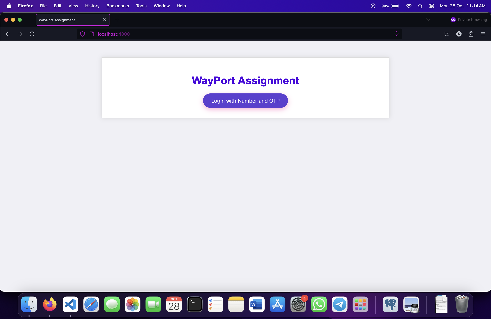
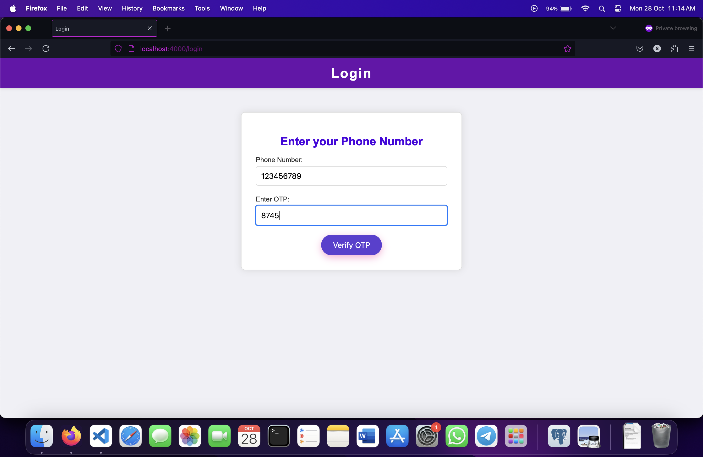
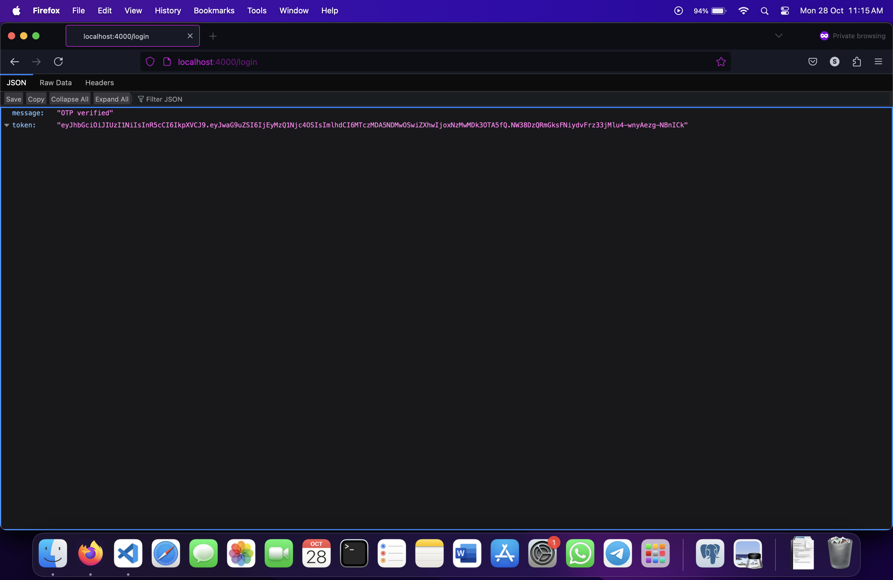

# WayPort Problem Statement 1

 For testing,  clone the repo and make sure you have node.js environment setup

All required node modules are included in the repo.
Use nodemon to run index.js file: "nodemon index.js"

Complete server sided logic is coded to first land on landingpage.ejs 
Once user enters the phone number , OTP is generated ( for testing purpose OTP is logged in the console)
Enter the OTP in the field which appears on the same page.
CLick Verify OTP 

After successful verification of OTP , a JSON response is shown on browser which shows 
"OTP Verified" and assign a token to the user upon verification.
The JSON response shows the token which is generated using JWT and can be further used for session management

1. **Landing Page**:
   - Access the landing page at `/`. This is the initial view of the application.

   

2. **OTP Verification**:
   - Enter the OTP in the provided field.

   

3. **OTP Verification**:
   - Check OTP in console.log

   

4. **JSON Response**:
   - JSON resposne shows the JWT token which is assigned to that user  upon successful OTP verification.

   
